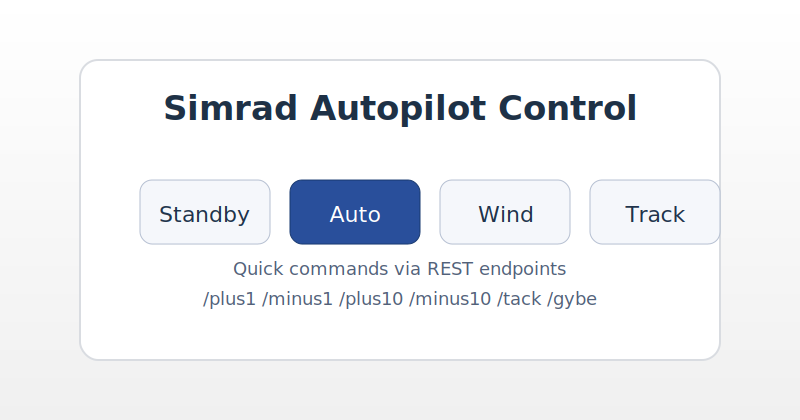

# signalk-autopilot-simrad

A Signal K server plugin for controlling **Simrad SimNet/NMEA 2000 tillerpilots** (TP22/TP32 and compatible pilots) by transmitting **PGN 127237 – Heading/Track Control**. The plugin targets gateways that accept raw NMEA 2000 frames over UDP using the Yacht Devices `YDRAW` format and exposes both REST and Signal K `PUT` interfaces for steering commands.

Once enabled, Signal K registers the plugin under the slug `signalk-autopilot-simrad`, which means the REST API is available at `/plugins/signalk-autopilot-simrad/*` and the optional UI is hosted at `/signalk-autopilot-simrad/`.

## Features

- Standby / Auto / Wind / Track mode control via PGN 127237
- Heading nudges (+/-1°, +/-10°) plus tack and gybe helpers
- Set commanded heading explicitly from REST, WebSocket PUTs, or the optional UI
- UDP writer for Yacht Devices YDWG gateways (customisable host/port/source/destination)
- Uses live heading data from Signal K (magnetic or true) for safe heading capture
- Optional passive subscriptions to navigation and wind data so Track/Wind modes have the information they need on the NMEA 2000 bus

## Requirements

- Signal K Server v2 or later with Node.js 18+
- A write-capable NMEA 2000/SimNet gateway (tested format: Yacht Devices YDWG-02/03 using raw frame output)
- Simrad tillerpilot connected to the same NMEA 2000 network

## Installation

1. Install the plugin into your Signal K server (for example on a Raspberry Pi running `@signalk/server`):

   ```sh
   cd ~/.signalk/node_modules
   git clone https://github.com/shlandrews/signalk-autopilot-simrad.git
   ```

2. Restart the Signal K server.
3. In the Signal K admin UI open **Server → Appstore → Installed**, locate **Simrad Autopilot (TP22/TP32) – NMEA 2000**, and enable it.
4. Configure the plugin (see options below) and save.

## Configuration options

| Option | Description |
| --- | --- |
| **Gateway host/IP** | IP address or hostname of the UDP gateway (default `192.168.4.1`). |
| **Gateway UDP port** | UDP port where the gateway accepts raw frames (default `1456`). |
| **NMEA 2000 source address** | Source address used for outgoing PGNs (0–252, default `25`). |
| **Destination address** | Destination address for frames (`255` for broadcast works on Simrad networks). |
| **Heading reference** | `magnetic` or `true`. Determines which heading Signal K data the plugin favours when capturing a reference for auto mode. |

The plugin listens to `navigation.headingMagnetic` and `navigation.headingTrue` from the Signal K data model to keep track of the vessel heading. If no live heading data is available, auto-engage and nudge commands will return an error rather than guessing.

## REST API

Routes are available under `/plugins/signalk-autopilot-simrad/*`:

| Endpoint | Description |
| --- | --- |
| `POST /standby` | Put the pilot into standby. |
| `POST /auto` | Engage auto mode using the last commanded heading (or the current vessel heading if none has been set). |
| `POST /wind` | Engage wind mode (requires true/apparent wind data on the network). |
| `POST /track` | Engage track mode (requires XTE/Bearing/Waypoint PGNs on the network). |
| `POST /plus1`, `/minus1` | Adjust heading by ±1°. |
| `POST /plus10`, `/minus10` | Adjust heading by ±10°. |
| `POST /tack`, `/gybe` | Large adjustments for tack (+100°) or gybe (-100°). |
| `POST /setHeading` | Set a specific commanded heading. Supply JSON `{"heading": 42}` or query `?heading=42`. |

Example commands:

```sh
curl -X POST http://signalk.local:3000/plugins/signalk-autopilot-simrad/auto
curl -X POST http://signalk.local:3000/plugins/signalk-autopilot-simrad/setHeading \
  -H 'Content-Type: application/json' \
  -d '{"heading": 215}'
```

## WebSocket / PUT support

Signal K clients can issue PUT requests to `steering.autopilot.command` on `vessels.self`. Accepted payloads include:

- String commands: `"standby"`, `"auto"`, `"wind"`, `"track"`, `"plus1"`, `"minus10"`, `"tack"`, `"gybe"`.
- Numeric heading (degrees): `215` engages auto and sets heading to 215°.
- Object payloads:
  - `{ "mode": "auto" }`
  - `{ "heading": 048 }`
  - `{ "heading": 048, "mode": "wind" }`
  - `{ "delta": 10 }` (equivalent to +10° nudge)
  - `{ "action": "plus1" }`

The handler returns `state: "SUCCESS"` on completion or provides an error message if the command cannot be fulfilled (for example when no heading data is available).

## Optional UI stub

A minimal web UI lives in [`public/`](public/) for experimentation or further development. When the plugin is enabled, Signal K serves it automatically at:

```
http://<your-server>:3000/signalk-autopilot-simrad/
```

The UI calls the REST endpoints above from the browser so you can drive the pilot directly. It is designed as a starting point—feel free to customise the layout or embed it into your own dashboards.




## Development

- The plugin sends raw `YDRAW` UDP lines; if you use a different bridge (e.g., Actisense NGT-1 with `signalk-to-nmea2000`), replace the `send127237` implementation with your preferred writer.
- `index.js` is intentionally dependency-free and targets Node.js 18+ as required by modern Signal K servers.
- Contributions and field reports welcome! Please open an issue or pull request.

## License

This project is released under the [MIT License](LICENSE).
